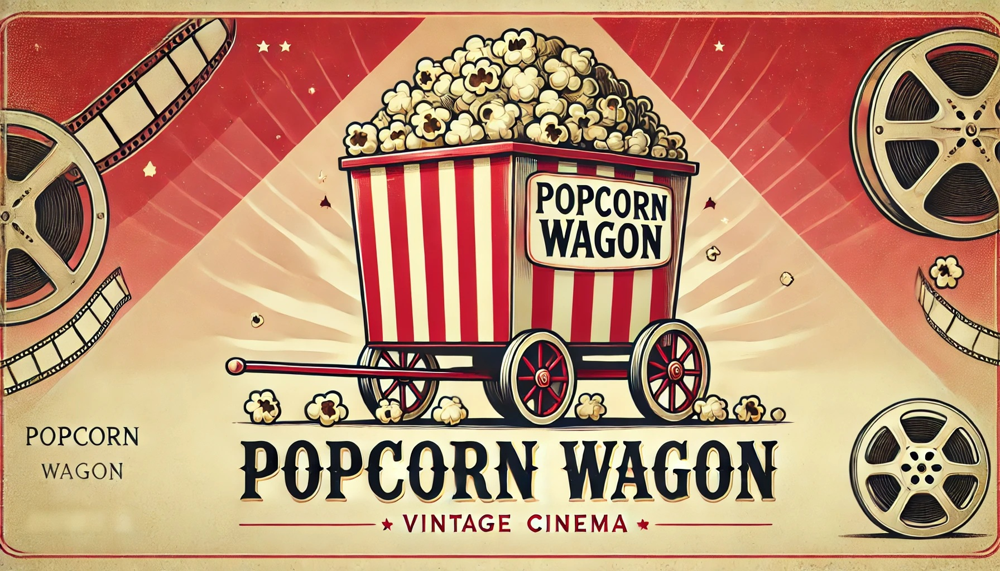

# Popcorn Wagon 🍿🎬

## Table of Contents
- [About Popcorn Wagon](#about-popcorn-wagon)
- [Features](#features)
- [Getting Started](#getting-started)
  - [Prerequisites](#prerequisites)
  - [Installation](#installation)
- [Project Structure](#project-structure)
- [License](#license)
- [Acknowledgments](#acknowledgments)
- [Powered By](#powered-by)

## About Popcorn Wagon
Popcorn Wagon is a Flask-based movie recommendation website designed to help you discover your next favorite movie. 
It leverages the **MovieLens Latest Dataset** and the **TMDB API** to provide personalized movie recommendations and detailed information about movies.

Whether you're a cinephile or just looking for something to watch, Popcorn Wagon has got you covered!

## Features
- **Movie Recommendations**: Get personalized movie recommendations based on the MovieLens dataset.
- **Movie Details**: View detailed information about movies, including posters, descriptions, and ratings, powered by the TMDB API.
- **User-Friendly Interface**: A clean and intuitive interface for exploring movies.
- **Efficient Data Management**: Flask backend with a SQLite database for fast and reliable data storage.

## Getting Started

### Prerequisites
- Python 3.x
- Flask
- SQLite
    
### Installation

1. **Clone the repository:**
- git clone https://github.com/frissonitte/popcorn-wagon.git
- cd popcorn-wagon

2. **Set up a virtual environment (optional but recommended):**
- python -m venv venv
- source venv/bin/activate  # On Windows: venv\Scripts\activate

3. **Install dependencies:**
- pip install -r requirements.txt

4. **Download the MovieLens Dataset**
- Download the [MovieLens Dataset (Full)](https://grouplens.org/datasets/movielens/latest/)
- Extract the dataset and place the files into the **app/data** folder.
- **DELETE the gnome-tags.csv and gnome-scores.csv files** since they are not used in this project.
- After creating the database, **do not delete the remaining *.csv files**.

`Commands for:`
5. **Setting up the database:**
- `python data_loader.py`
6. **Running the Flask application:**
- `python run.py`
7.  **Accessing the website:**
- Ctrl-click to link in the terminal or open your browser and navigate to http://127.0.0.1:5000

## Project Structure:
popcorn-wagon/
├── app/
│   ├── data/                  # Folder for dataset files
│   │   └── *.csv              # MovieLens .csv files
│   ├── static/                # Static files (CSS, JS, images)
│   ├── templates/             # HTML templates
│   ├── __init__.py            # Flask app initialization
│   ├── routes.py              # Flask routes
│   ├── extensions.py          # Stores app's extensions
│   └── models.py              # Database models
├── instance/                  # Our database will be here
├── migrations/                # Handles SQLAlchemy database migrations
├── venv/                      # Virtual environment
├── .env                       # Stores sensitive information.(You need to create your own)
├── data_loader.py             # Script to initialize the database
├── app.py                     # Stores the flask app
├── run.py                     # Application start point
├── requirements.txt           # Python dependencies
├── README.md                  # Project documentation
└── LICENSE                    # Project license

## License:
- This project is licensed under the MIT License. See the LICENSE file for details.

## Acknowledgments
- [MovieLens](https://grouplens.org/datasets/movielens/) for providing the dataset.
- [The Movie Database (TMDB)](https://www.themoviedb.org/) for their API, which powers additional movie details and metadata.
- [Flask](https://flask.palletsprojects.com/) for the awesome web framework.

## Powered by

